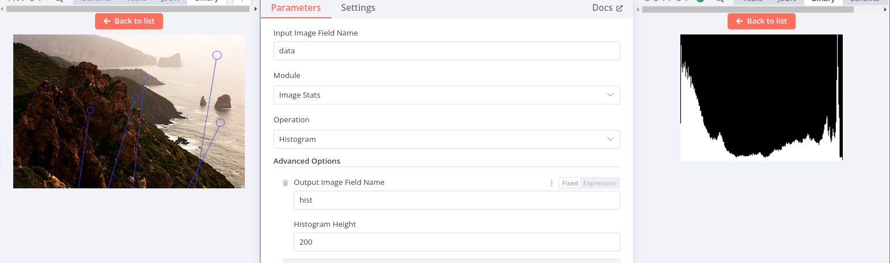
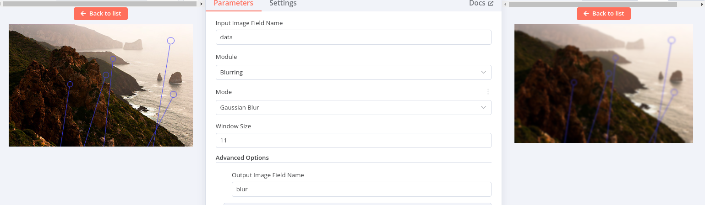

# n8n-nodes-opencv

This is an N8N community node. It lets you use [OpenCV.js](https://docs.opencv.org/3.4/df/d0a/tutorial_js_intro.html) (a
version of OpenCV that can run in browsers and Node.JS environments) in your N8N workflows.

OpenCV is an open-source image processing library that contains lots of computer vision algorithms.
This node exposes some common OpenCV operations so they can be used in N8N workflows.

For example:

* Image binarization/thresholding:
	
* Binary operations (e.g. NOT):
	
* Morphological operators (erosion, dilation, opening, closing):
	
* Histogram computation
	
* Various blurring algorithms
	
* Edge detection algorithms (e.g. Canny, Laplacian)
	
* Contour detection
	

[Installation](#installation)  
[Resources](#resources)  
[Development](#development)

## Installation

Follow the [installation guide](https://docs.n8n.io/integrations/community-nodes/installation/) in the n8n community
nodes documentation.

## Resources

* [n8n community nodes documentation](https://docs.n8n.io/integrations/community-nodes/)
* [OpenCV.js docs](https://docs.opencv.org/3.4/d5/d10/tutorial_js_root.html)


## Development

1. Clone the repo:
	 ```
	 git clone https://github.com/jreyesr/n8n-nodes-opencv.git
	 ```
2. Run `pnpm i` to install dependencies.
3. Open the project in your editor.
4. Make changes, fix bugs, or add new operations. To add a new operation:
	* If adding a new operation on an existing module (e.g. another thresholding algorithm), add it
		on `nodes/OpenCvNode/actions/<module_name>/<new_operation_name>.operation.ts`, and register it
		on `nodes/OpenCvNode/actions/<module_name>/index.ts`
	* If adding an entirely new module (a broad set of OpenCV functionality, e.g. "object tracking" or "DNNs"), add it
		on `nodes/OpenCvNode/actions/<new_module_name>`, and register the new module
		on `nodes/OpenCvNode/OpenCvNode.node.ts`
5. Run `pnpm lint` to check for errors or `pnpm lintfix` to automatically fix errors when possible.
6. Test the node locally. Refer
	 to [Run your node locally](https://docs.n8n.io/integrations/creating-nodes/test/run-node-locally/) for guidance.
7. (jreyesr only) [Publish](https://docs.npmjs.com/packages-and-modules/contributing-packages-to-the-registry) the
	 package to npm.

## Changelog

### v1.0.0

Initial release

* Binary operations (multiple thresholding algorithms, including adaptive algs)
* Morphological operations (erosion, dilation, opening, closing)
* Blurs (box, gaussian, bilateral, ...)
* Convert a color image to grayscale
* Contours and connected components: CC detection, contour drawing
* Edge detection (Canny, Sobel, laplacian, ...)

## License

[Apache License v2.0](LICENSE.txt)
